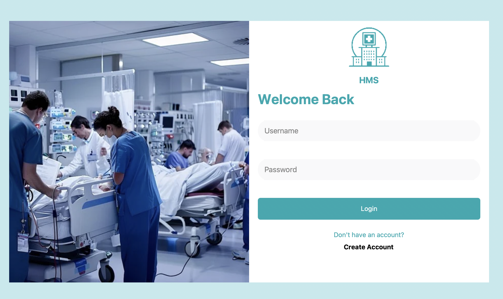
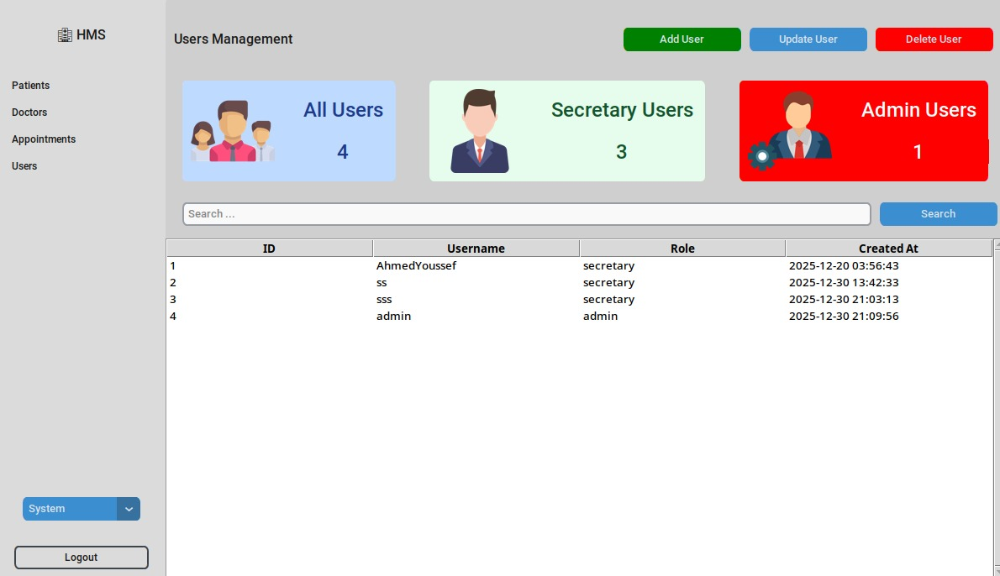
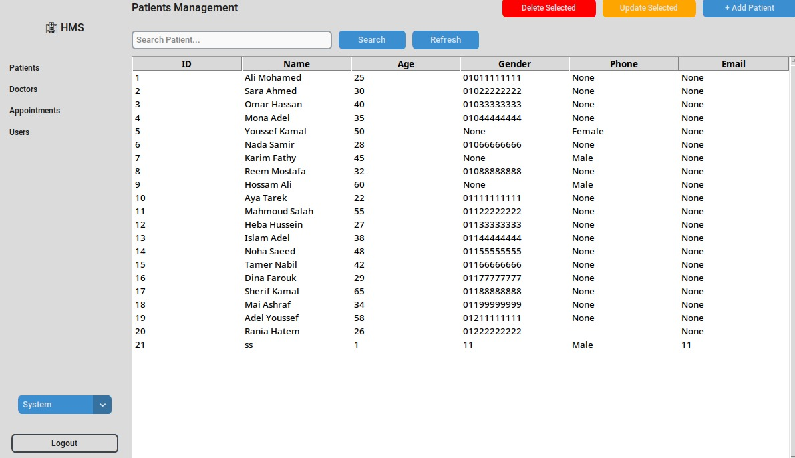
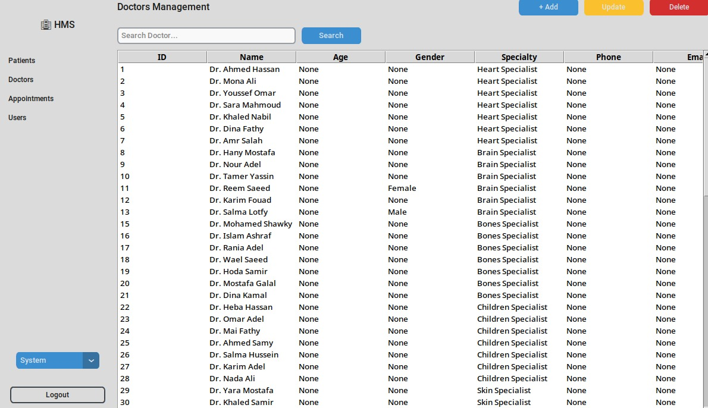
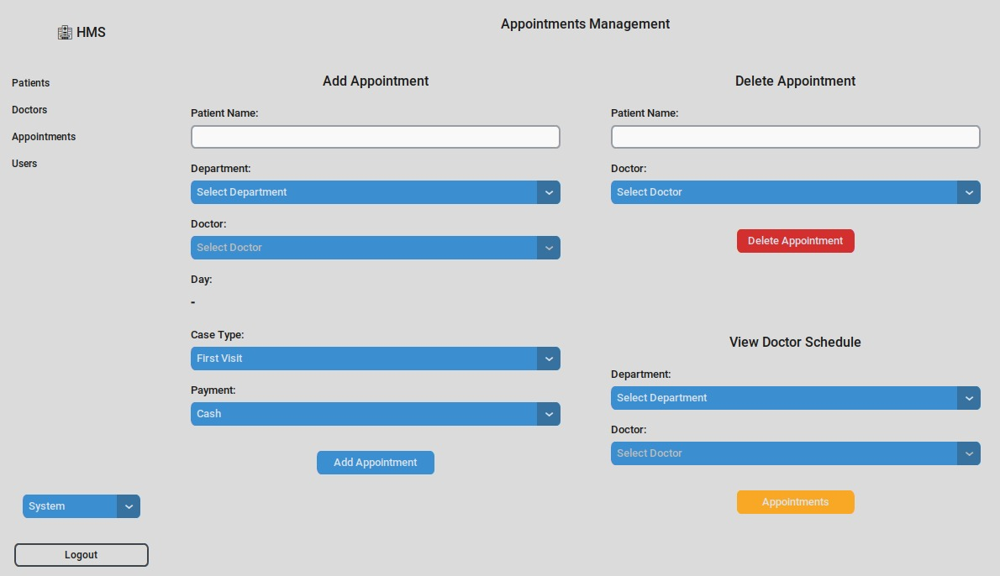

# Hospital Management System – OOP Project (Python + SQLite)


A Python-based Hospital Management System that combines ***Object-Oriented Programming***, a modern CustomTkinter GUI, and **SQLite** integration. It enables users to manage patient data, doctor assignments, and user authentication through a clean, modular architecture.

---

## Features

- Login Authentication System
- Add / Delete Patients
- Add Doctors & Assign Them to Patients
- View Patient and Doctor Details
- User Management
- GUI-based operation with modern dark mode support
- SQLite Database Integration

---

## Tech Stack

- **Language:** Python
- **GUI:** CustomTkinter
- **Interface:** GUI
- **Database:** SQLite (`hospital.db`)
- **Design Pattern:** Object-Oriented Programming

---

## Project Structure

```
Hospital-Management/
├── main.py             # GUI entry point
├── backend/            # Business logic and database
│   ├── database/       # Database connection
│   │   ├── connectDB.py
│   │   └── schema.py
│   ├── models/         # OOP-based entity classes
│   │   ├── user.py
│   │   ├── person.py
│   │   ├── patient.py
│   │   └── doctor.py
│   └── controllers/    # Logic controllers
│       └── auth.py
├── ui/                 # GUI Views
│   ├── login_view.py
│   ├── signup_view.py
│   ├── appointments_view.py
│   ├── doctors_view.py
│   ├── patients_view.py
│   ├── users_view.py
│   └── sidebar.py
└── .venv/              # Optional virtual environment
```

---

## Setup Instructions

### 1. Clone the Repository

```bash
git clone https://github.com/ibrahimymhafez/hospital-management-system.git
cd hospital-management-system
```

### 2. (Optional) Create a Virtual Environment

```bash
python -m venv .venv
source .venv/bin/activate  # For Windows: .venv\Scripts\activate
```

### 3. Install Dependencies

```bash
pip install customtkinter python-dotenv
```

### 4. Database Setup

The application uses SQLite. The database file `hospital.db` and the necessary schema tables will be automatically created when you run the application if they do not exist.

Ensure you have a `.env` file or that the `DB_NAME` is correctly set in `backend/database/connectDB.py` (defaults to environment variable).

### 5. Run the Application

Run the GUI version:

```bash
python main.py
```

### Sample Credentials

You may need to sign up a new user via the "Sign Up" screen on the first run.

---

## Class Diagram

The project uses an Object-Oriented approach with the following core relationships:

- **Person** (Base Class)
- **Doctor** (Inherits from Person)
- **Patient** (Inherits from Person)
- **User** (Inherits from Person)

---

## Application Screens
# SignUp Screen


# Login Screen


# Users Screen


# Patients Screen


# Docotrs Screen


# Appointments Screen



---

## Authors

- [Ibrahim Hafez](https://github.com/ibrahimymhafez)
- Ahmed Youssef
- Samir Ahmed
- Ahmed Rashed

## License

This project is licensed under the MIT License.
